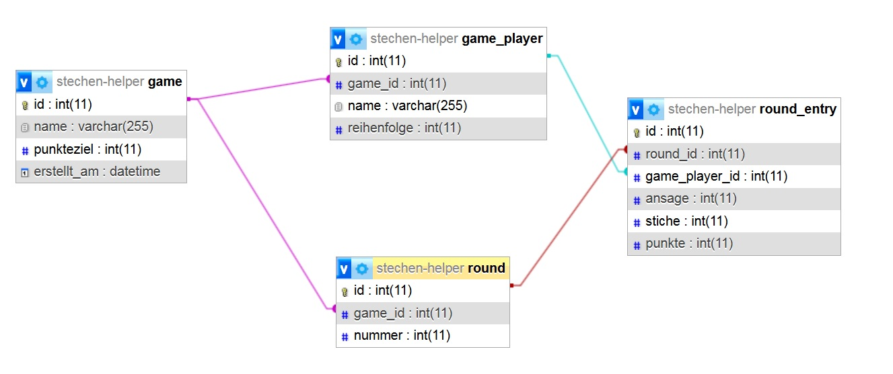

# Stechen-Spielverwaltung

## Projektübersicht

**Ziel:**  
Verwaltung eines Karten-/Stichspiels („Stechen“) mit Spieler-Adressbuch, Spielverwaltung, Runden und Punktezählung.

**Tech-Stack:**
- **Frontend:** React, Bootstrap (aktuell), Font Awesome 5.x
- **Backend:** Symfony (API), PHP
- **Datenbank:** MySQL/MariaDB/PostgreSQL (je nach Hosting)

---

## Roadmap

### 1. Planung & Setup

- [x] Projektziele und Anforderungen finalisieren
- [x] ER-Diagramm und Datenbankmodell fertigstellen
- [x] Symfony-Projekt initialisieren (API-only, z.B. mit API Platform oder nur Serializer/Controller)
- [x] Frontend-Projekt mit React, Bootstrap und Font Awesome initialisieren

---

### 2. Backend: Symfony

#### a) Grundstruktur

- [x] Datenbankverbindung konfigurieren
- [x] Entities/Doctrine Models anlegen:
    - Player (Adressbuch)
    - Game
    - GamePlayer (Teilnehmer)
    - Round
    - RoundEntry (Rundeneinträge)
- [x] Relationen gemäß ER-Diagramm anlegen

#### b) API Endpoints

- [ ] Players: CRUD fürs Adressbuch (optional: Suche/Autovervollständigung)
- [ ] Games: Spiel anlegen, Details abrufen, Liste der Spiele
- [ ] GamePlayers: Teilnehmer zu Spiel hinzufügen (aus Adressbuch oder als Gast)
- [ ] Rounds & RoundEntries: Runden anlegen, Einträge verwalten, Ergebnisse berechnen
- [ ] Punkteberechnung: Logik für Auswertung der Stiche und Punkte

#### c) (Optional) API Platform nutzen

- Vorteil: Automatische REST-API-Generierung, OpenAPI/Swagger-Doku, einfache Filter/Suche

---

### 3. Frontend: React

#### a) Grundstruktur

- [ ] Projektstruktur anlegen, Routing einrichten
- [ ] Bootstrap & Font Awesome einbinden

#### b) Views/Seiten

- [ ] Spieler-Adressbuch (Listen, Hinzufügen, Suchen)
- [ ] Spiel erstellen (mit Teilnehmer-Auswahl, Zielpunkte, etc.)
- [ ] Übersicht laufender und vergangener Spiele
- [ ] Spiel-Detailansicht (Runden, Teilnehmer, Punktestand)
- [ ] Rundenansicht (Ansagen, Ergebnisse eingeben)
- [ ] Punkteauswertung/Statistik

#### c) API-Anbindung

- [ ] REST-API-Calls zu Symfony-Backend (z.B. mit Axios oder Fetch)
- [ ] Fehlerbehandlung und Feedback für User

---

### 4. Testing & Feinschliff

- [ ] Backend: Unit- und Integrationstests für API und Logik
- [ ] Frontend: Usability-Tests, ggf. automatisierte Tests
- [ ] Responsives Design prüfen
- [ ] Performance-Optimierung

---

### 5. Deployment

- [ ] Backend auf Webserver deployen (z.B. Apache/Nginx, PHP-FPM, Datenbank)
- [ ] Frontend bauen und deployen (z.B. als statische Dateien, ggf. über den gleichen Server)
- [ ] Umgebungsvariablen, Konfiguration, Sicherheit prüfen

---

## Setup & Migration

1. **Abhängigkeiten installieren:**
    ```bash
    composer install
    npm install # im frontend-Ordner
    ```

2. **Umgebung konfigurieren:**
    - `.env`-Dateien für Backend und Frontend konfigurieren (z.B. DB-Zugangsdaten).

3. **Datenbankmigration durchführen:**
    ```bash
    php bin/console doctrine:migrations:migrate
    ```

4. **(Optional) Frontend starten:**
    ```bash
    npm start
    ```

---

## Datenmodell (vereinfacht)

| Entität      | Beschreibung                                         | Wichtige Felder                          |
|--------------|------------------------------------------------------|------------------------------------------|
| **Player**   | Spieler-Adressbuch                                   | id, name, ...                            |
| **Game**     | Ein Spiel                                            | id, name, punkteziel, erstellt_am        |
| **GamePlayer** | Teilnehmer eines Spiels (Verknüpfung zu Player)    | id, game_id, name, reihenfolge           |
| **Round**    | Eine Runde innerhalb eines Spiels                    | id, game_id, nummer                      |
| **RoundEntry** | Ein Eintrag pro Spieler und Runde                  | id, round_id, game_player_id, ansage, stiche, punkte |

Beziehungen siehe ER-Diagramm im Projekt oder hier im Bild:



---

## Hinweise

- **Migration:** Nach Änderung der Entities immer `php bin/console make:migration` und dann `php bin/console doctrine:migrations:migrate` ausführen.
- **Datenbank:** MySQL, MariaDB oder PostgreSQL werden unterstützt.
- **Entwicklung:** Für lokale Entwicklung kann SQLite genutzt werden (einfach DB-URL in `.env` anpassen).

---

